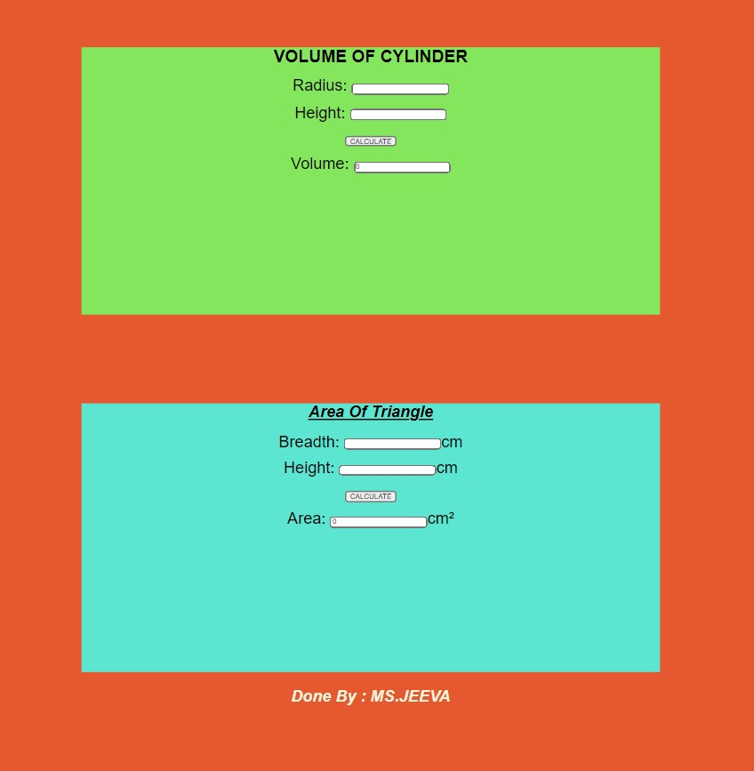

# Web Page for Mathematical Calculations

## AIM:

To design a static website with validation to perform mathematical calculations in client side.

## DESIGN STEPS:

### Step 1:

Requirement collection.

### Step 2:

Creating the layout using HTML and CSS.

### Step 3:

Write javascript to perform the calculations.

### Step 4:

Include regularexpression based input validation.

### Step 5:

Validate the layout in various browsers.

### Step 6:

Validate the HTML code.

### Step 6:

Publish the website in the given URL.

## PROGRAM :
```

<!DOCTYPE html>
<html lang="en">
  <head>
    <meta charset="UTF-8" />
    <meta http-equiv="X-UA-Compatible" content="IE=edge" />
    <meta name="viewport" content="width=device-width, initial-scale=1.0" />
    <title>Mathematical Calculations</title>
    <style>
      * {
       box-sizing: border-box;
       font-family: Arial, Helvetica, sans-serif;
        }
       body{
           background-color: #e65c5c;
       }
       .container{
           width:1080px;
           margin-left: auto;
           margin-right: auto;
       }
       .content{
           display: block;
           width:100%;
           background-color: lightcoral;
           margin-top: 150px;
           min-height:500px;
       }
       h1{
           text-align: center;
           margin-top: 15;
       }
       .formelement{
           text-align: center;
           font-size: 30px;
           font-style:normal;
           margin-top: 15px;
       }
       .text{
           text-decoration:underline;
           font-style: oblique;
           font-size: 30px;
       }
    </style>
</head>
<body>
    <div class="container">
        <div class="content">
            <h1> VOLUME OF CYLINDER</h1>
            <form>
                <div class="formelement">
                    <label for="aedit">Radius:</label>
                    <input type="text" id="aedit"/>
                </div> 
                <div class="formelement">
                    <label for="bedit">Height:</label>
                    <input type="text" id="bedit"/>
                </div>
                <div class="formelement">
                    <input type="button" value="CALCULATE" id="addbutton"/>
                </div>
                <div class="formelement">
                    <label for="cedit">Volume:</label>
                    <input type="text" id="cedit" value=0 readonly/>
                </div>
            </form>
        </div>
    </div>
<script type="text/javascript">
    var button;
    button=document.querySelector("#addbutton");
    button.addEventListener("click",function(){
      var atext,btext,ctext;
      var aval,bval,cval;

      atext=document.querySelector("#aedit");
      btext=document.querySelector("#bedit");
      ctext=document.querySelector("#cedit");

      aval=parseFloat(atext.value);
      bval=parseFloat(btext.value);
      cval=3.14*(aval**2)*bval;
      ctext.value=""+cval;

    });
</script>
</body>
</html>
});
</script>
<style>
  * {
   box-sizing: border-box;
   font-family: Arial, Helvetica, sans-serif;
    }
   body{
       background-color: #e65830;
   }
   .container{
       width:1080px;
       margin-left: auto;
       margin-right: auto;
   }
   .content{
       display: block;
       width:100%;
       background-color: #83e65c;
       margin-top: 150px;
       min-height:500px;
   }
   .content1{
       display: block;
       width:100%;
       background-color:#5ce6d1;
       margin-top: 150px;
       min-height: 500px;
   }
   h1{
       text-align: center;
       margin-top: 15;
   }
   .formelement{
       text-align: center;
       font-size: 30px;
       font-style:normal;
       margin-top: 15px;
   }
   .by{
       text-align: center;
       font-style: italic;
       font-size: 30px;
       color:beige;
    }
     </style>
 <body>
      <div class="container">
        <div class="content1">
            <h1 class="text"> Area Of Triangle</h1>
            <form>
                <div class="formelement">
                    <label for="breadthedit">Breadth: </label>
                    <input type="text" id="breadthedit"/>cm
                </div> 
                <div class="formelement">
                    <label for="heightedit">Height:  </label>
                    <input type="text" id="heightedit"/>cm
                </div>
                <div class="formelement">
                    <input type="button" value="CALCULATE" id="tributton"/>
                </div>
                <div class="formelement">
                    <label for="triedit">Area:</label>
                    <input type="text" id="triedit" value=0 readonly/>cm²
                </div>
            </form>
        </div>
    </div>
    <script>
        function validate(){
            var user1=document.getElementById("breadthedit").value;
            var user2=document.getElementById("heightedit").value;
            var re=/^[0-9]+$/;
            if(re.test(user1)){
                return true;
            }
            else if(re.test(user2)){
                return true;
            }
            else{
                alert("Please input numeric characters only");
                return false;
            }
        }
    </script>
  <script type="text/javascript">
     var button;
     button=document.querySelector("#tributton");
      button.addEventListener("click",function(){
       var breadthtext,heighttext,tritext;
       var breadthval,heightval,trival;
  
       breadthtext=document.querySelector("#breadthedit");
       heighttext=document.querySelector("#heightedit");
       tritext=document.querySelector("#triedit");
  
       breadthval=parseInt(breadthtext.value);
       heightval=parseInt(heighttext.value);
       trival=0.5*breadthval*heightval;
       tritext.value=""+trival;
      });
  </script>
  <footer> <p class="by"> <B> Done By : MS.JEEVA</B></p></footer>
 </body>
</html>
```

## OUTPUT:



## Result:

Thus a website is designed to perform mathematical calculations in the client side.
